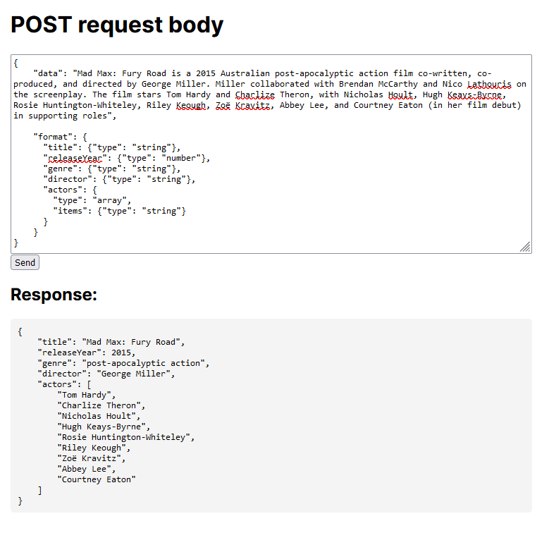

## JSON API

This project is an API which accepts a POST request containing text and a JSON schema. It will use AI to extract data from the text and return it as a JSON in the specified schema.

POST body:
```
{
    "data": "I'm Eduard, a 33 years old engineer who likes electronics and programming.",

    "format": {
        "name": {"type": "string"},
        "age": {"type": "number"},
        "occupation": {"type": "string"},
        "hobbies": {"type": "array", "items": {"type": "string"}}
    }
}
```
Returned JSON:
```
{
    "name": "Eduard",
    "age": 33,
    "occupation": "engineer",
    "hobbies": [
        "electronics",
        "programming"
    ]
}
```

You can try te API by sending an HTTP request through an application like Postman to the entrypoint /api/json.

Alternatively you can use an interface located at the homepage of the app:



Note that if you run this project locally, you'll have to provide your own OpenAI API key in the .env file

## Getting Started

This is a [Next.js](https://nextjs.org/) project bootstrapped with [`create-next-app`](https://github.com/vercel/next.js/tree/canary/packages/create-next-app).


First, run the development server:

```bash
npm run dev
# or
yarn dev
# or
pnpm dev
# or
bun dev
```

Open [http://localhost:3000](http://localhost:3000) with your browser to see the result.

You can start editing the page by modifying `app/page.tsx`. The page auto-updates as you edit the file.

This project uses [`next/font`](https://nextjs.org/docs/basic-features/font-optimization) to automatically optimize and load Inter, a custom Google Font.

## Learn More

To learn more about Next.js, take a look at the following resources:

- [Next.js Documentation](https://nextjs.org/docs) - learn about Next.js features and API.
- [Learn Next.js](https://nextjs.org/learn) - an interactive Next.js tutorial.

You can check out [the Next.js GitHub repository](https://github.com/vercel/next.js/) - your feedback and contributions are welcome!

## Deploy on Vercel

The easiest way to deploy your Next.js app is to use the [Vercel Platform](https://vercel.com/new?utm_medium=default-template&filter=next.js&utm_source=create-next-app&utm_campaign=create-next-app-readme) from the creators of Next.js.

Check out our [Next.js deployment documentation](https://nextjs.org/docs/deployment) for more details.
